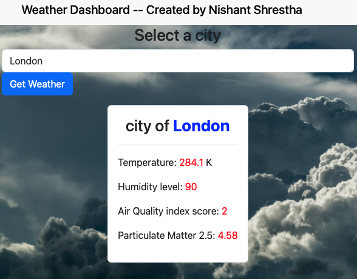

## Project Title

**Weather Dashboard** -  Created by **Nishant Shrestha**

## Description

This is an HTML, CSS, and JavaScript program that allows users to select a city from a dropdown list and display the weather (air quality as well) information for the selected city.

The HTML file starts with the standard document type declaration and contains a head and a body. The head section contains a title and links to two stylesheets, one for custom styles and another for the Bootstrap CSS framework.

In the body section, there is a navigation bar with an introductory title and a container for the main content. The main content contains a form for selecting a city, a button for fetching weather data, and a display section for showing the weather and air quality information.

The JavaScript code retrieves weather and air quality information from the OpenWeatherMap API and displays it in the display section. The code first gets the form and button elements from the HTML document and adds an event listener to the button element to handle a click event.

When the button is clicked, the code uses the selected city to make a request to the OpenWeatherMap API to fetch the latitude and longitude of the city. It then uses this retrieves a URL to fetch air pollution data using the latitude and longitude and makes another similar API request to get the weather data.

When the API responses are received, the code extracts the relevant information from the response and displays it in the display section. The display contains elements for the city name, temperature, humidity, description, air quality index, and PM2.5 value. The code populates these elements with the data fetched from the API. Please note, this dashboard uses the free version of the API. 

In a nutshell, this program is a simple dashboard that fetches data using AJAX from the OpenWeatherMap API and displays it in a user-friendly format.

## Usage 

As can be seen in the picture, when you select a city and click on the button, "Get Weather", the weather inforation pops up in the display. You can then re-select another city from the list of cities and check their weather as well. 

(PS: generate a markdown file to look at the picture)

## How to use

Simply, double click on the index.html file or run the localhost URL of the file on your web browser.

## Credits

Open Weather Map API documentation.

## Contact

email me at ns037@bucknell.edu
